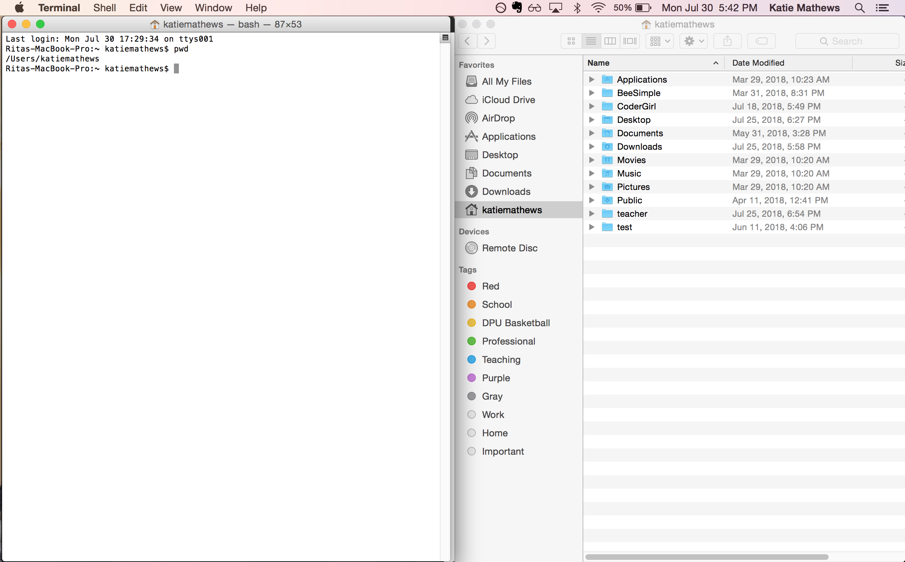

# In-Class 3

**Outline**
* Open Q&A about HTML/CSS
* Quick Talk: Intro to Command Line


**Slides:** [Class 3 Slides](https://docs.google.com/presentation/d/1vODHE3SLrSW5nizD_o_dDtkNk2Hfsj03QJM_C5tJELg/edit?usp=sharing)


## Quick Talk: Intro to Command Line

Command line is a more powerful way to interact with your computer.

It used to be the ONLY way to interact with a computer. But today, most people interact with picture displayed on their computer called a GUI (graphical user interface). This is great for most people because you don't have to know the actual computer language in order to use your computer!

However, the picture is just for users. A computer doesn't understand them. So eventually all your click on application icons or buttons, get interpreted to a series of commands in a language your computer understands.

Using the command line removes the picture mediator and gives you, a developer, the opportunity to communicate to your computer directly.


### Watch Video & Read Resources

1. [Video: Programming 101](https://www.youtube.com/watch?v=rNQ5X9gEL4U&feature=youtu.be)
2. [Treehouse Article: Introduction to the Command Line](http://blog.teamtreehouse.com/introduction-to-the-mac-os-x-command-line)
3. [Article: An intro to the command line](https://eddywashere.com/blog/an-intro-to-the-os-x-command-line/)


> Quick note: Both macs and windows have command line applications already install on their computer systems. The mac version is called Terminal. The windows version is called Command Prompt. Mac people, you will be using the Terminal. Windows people you won't be using the Command Prompt. Instead you will use an application you should have install the first day (if not link below), Git Bash._

> For windows: [Install Git Bash](https://gitforwindows.org/)


### How developers use the Command Line?

1. Navigate through folders/directories
2. Create files and folders/directories
3. Install other programming languages and tools
4. Use various development tools


### Basics of Enter a Command

Open your terminal application (mac) or git bash application (windows). This is where you will enter commands.

You should see a `$` at the end of the line and a cursor right after it.

Basics of command line entry.

1. Enter command.
2. Hit Enter.
3. Computer runs the command and might print out feedback.

A command is structured like this:

`$ <command> -<cmd-options> <cmd-arguments>`


Ready to type a few!


### Commands for File Navigation and Creation

> note: do not type the dollar sign! that is just an indication that your command line is ready for a command. I will have it in the examples below to indicate what to type.


**Current Location or Working Directory**

```
$ pwd
```
pwd stands for print working directory. This will print out, in your terminal, where you currently are in your file system. It's like a location. Your current location in your terminal is often called your **working directory**. Hence the command name, print working directory.

If you enter that command right now... you should get something like...
```
$ pwd
/Users/your-username
```
except `your-username` should be the username you are logged in with on your computer.

Every time you open your terminal application, you will start in this directory, your user directory. **THIS IS IMPORTANT TO KNOW.**

Because when you create html/css files on your computer, you need to have access to them from the command line. so best practice is to create them somewhere in your user directory. Otherwise it will be hard to access them.

Now that you know you are in your user folder let's navigate to this same folder but through your computer's GUI.

Windows: [Follow these instructions](https://www.youtube.com/watch?v=TphsACeMRd8)

Mac: [Follow these instructions](https://www.cnet.com/how-to/how-to-find-your-macs-home-folder-and-add-it-to-finder/)

When you found your user folder with your computers GUI... proceed. Position your terminal and your file explore gui side by side like such:



&nbsp;

**Seeing inside Working Directory**

```
$ ls
```

So we should be in the same directory with our terminal and with our gui... with our gui, we can see the contents of the directory we are in. With our terminal we cannot. The next command will help!

The ls command is used to _list_ the contents of the directory your are currently in (your working directory). If you enter the above into your terminal you should see printed out all the folders and files you currently see in the gui. Try it out.

This command can also take "options". There are many different options you can add to almost any command. For the list command the options I like are:
```
$ ls -l
```

The `l` option will list the folder content vertical. Instead of how it displayed before.

```
$ ls -a
```
The a option stands for all. It lists ALL files and folders. Even the ones hidden in your GUI view.

Try it. What files appear that your didn't see before?

You can combine both options at once with the command:
```
$ ls -la
```

&nbsp;

**Changing Folders/directories**

```
$ cd <directory-to-navigate-to>
```

In your gui, pick a folder you want go into... click on it.

The `cd` command let's you do the same thing that you just did in your gui. Go into a folder (or to a location). It stands for _change directory_. If I wanted to go into my `teacher` folder, I would enter the command:

```
$ cd teacher
```

Now use the `pwd` command to make sure you actually moved into that directory. And use the `ls` to display the folders in that directory :)

&nbsp;

**Create Folders**

```
$ mkdir <folder-name>
```

&nbsp;

**Create Files**

```
$ touch <file-name.text>
```

### Practice: Navigating File Structure
