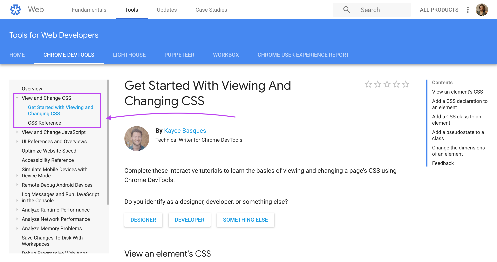
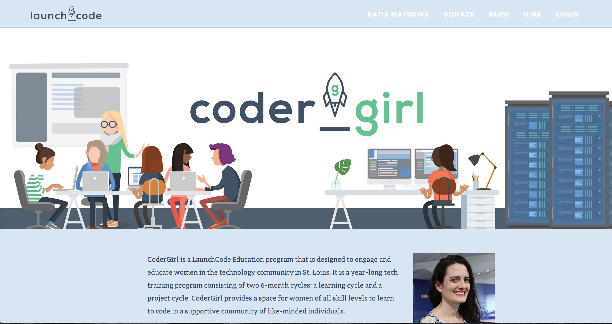

# Web Dev Tools for HTML CSS

One reason developers use Google Chrome a lot for building websites is Google Chrome's Developer tools... often just referred to as Web Dev Tools. In this assignment you will learn how to use these tools.

**Plan:** List steps/tasks in [Trello Boards](https://trello.com/cg_webdev_ss_2018)

**Do:** Complete requirements below.

**Record:** [Canvas Assignment - Lesson 4.1 Dev Tool Challenge](https://learn.launchcode.org/courses/131/assignments/7007)

## Tutorial

Google Provides a pretty good interactive tutorial on how to get started using these tools.

Please complete both lessons under "View and Change CSS" (see below).

The other tutorials on the site probably won't make sense right now. So we will come back to them later.

[Google Chrome: View and Change CSS](https://developers.google.com/web/tools/chrome-devtools/css/)

## Challenge & Submission

Let's put to test what you should have learned in the above tutorial by going to the LaunchCode CoderGirl web page and changing some CSS with the dev tools.

**Your Challenge**
1. Navigate to the [LaunchCode CoderGirl web page](https://www.launchcode.org/coder_girl) in the Chrome browser.
2. Open the Developer Tools.
3. Change the Navbar to meet the requirements and match the picture below.
4. Take a screen shot of your changes. (_if you aren't sure how to take a screen shot of your computer screen, use google to help you figure that out_).
5. Submit that picture with your canvas assignment :)

**Requirements for Change**
1. Navbar background color has to match the background color in the first paragraph with Sally's head.
2. Navbar links need a white text color.
3. Navbar bottom border-color needs to match the color of the signup button towards the bottom of the page.
4. Change the first nav link text, "Get Started", to be your name!

That's it! Make sure to screen shot and submit your picture to canvas (link at top).
