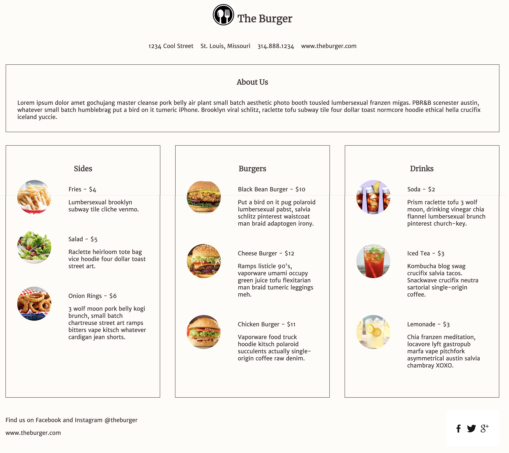

# Flex Layout Challenge

Use your new knowledge about layout and flexbox to complete this CodePen challenge!

**Plan:** List steps/tasks in [Trello Boards](https://trello.com/cg_webdev_ss_2018)

**Do:** Complete requirements below.

**Record:** [Canvas Assignment - Lesson 5.4 Flex Layout Challenge](https://learn.launchcode.org/courses/131/assignments/7023)

## Intro

In the last two assignments you spent some time learning different css properties to layout html elements correctly. Now with this challenge you are going to apply those tools.

When working through the challenge it is good to have a reference to all the flex properties you have learned. Here is a link we think is great, but also feel free to google around yourself. If you find one you like, it might be helpful to "Bookmark" that webpage so you can come back to it.

[Flexbox Reference](https://cssreference.io/flexbox/)

## Flex Layout Challenge

Time to put those theoretical skills to the test and solve some layout problems with flexbox.

Goal: to make the CodePen match this picture below.

[CodePen - Flexbox Menu Challenge](https://codepen.io/ekaiser93/pen/VBRvgY?editors=1100)

_note: with CodePens, make sure to "fork" the project and save it as your own CodePen. You will need a free CodePen account :)_

When done submit your assignment with your CodePen link! (on Canvas, link above)
