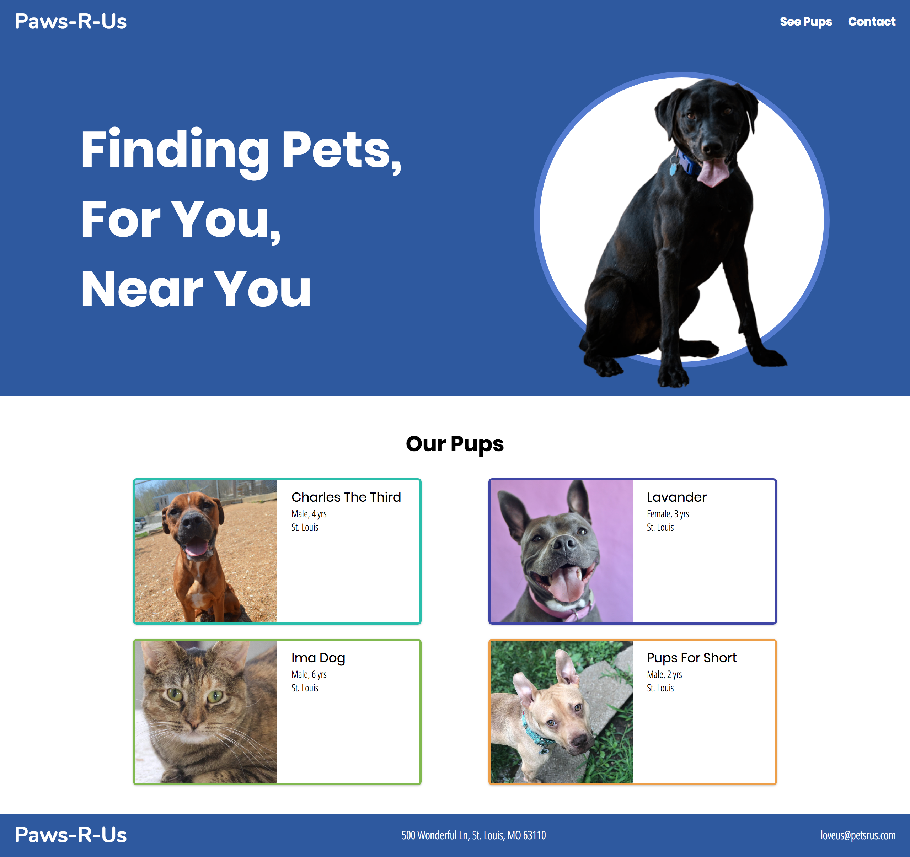
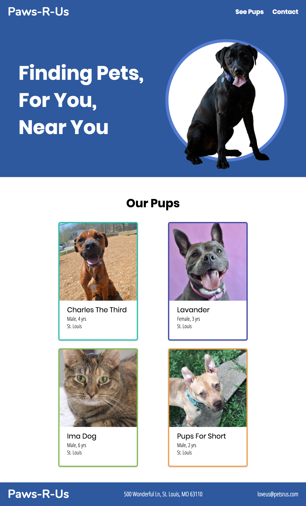
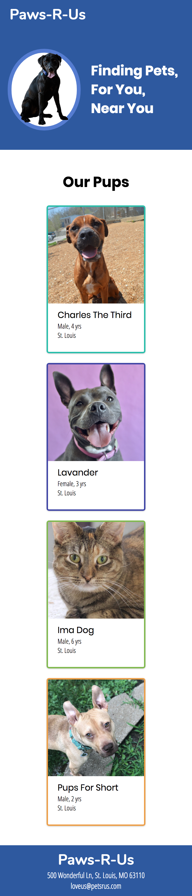

# Responsive Challenge - Dog Adoption Site

In this challenge you will be turning a fixed width site into a responsive site using the tips you learned in the previous assignment.

**Plan:** List steps/tasks in [Trello Boards](https://trello.com/cg_webdev_ss_2018)

**Do:** Complete requirements below.

**Record:** [Canvas Assignment - Lesson 6.2 Responsive Challenge](https://learn.launchcode.org/courses/131/assignments/7040)

## Setup

**Fork this repository on Github.**

Follow this link to the project on GitHub:
<a href="https://github.com/ktmathews89/dog_adoption" target="_blank">Dog Adoption Site</a>

Then Fork the project to make a copy for yourself in your own github account. To do that just click the "Fork" button in the top right corner of the Github page you just navigated to.

When the fork is complete, github should have navigated you to _your_ version of the project. Check this by looking for your user name on the github page.

**Clone your Github repo to your computer**

This creates a copy of your project on your computer so you can edit like normal. Follow these instructions to <a href="https://services.github.com/on-demand/github-cli/clone-repo-cli" target="_blank">clone your github repo</a>.

**Open your project files**

Now that you have your project on your computer... open your project with atom and open the `index.html` file in your browser.

Now your ready to work!

## Project Challenge

First, check out the site in the browser. Adjust the screen size by dragging the browser width bigger and then smaller. The site is complete static... meaning as you drag the broswer window, nothing changes and the site gets cut off.

**Your Goal: **
To make the site look good on _ALL_ screen sizes.

In general here are things you need to do:
* Make the CSS Units responsive by changing out px for (%, rem, em, vh, vw)
* Make horizontal widths, padding, margin responsive
* Use media query breakpoints to adjust things at different screen widths

The below pictures are guides to help give you a picture of what the site should look like on different screens :) Try to match them as best you can but keep in mind the site needs to look good on ALL screen sizes.

Good luck! Remember to ask for help if you get stuck.

**Desktop**

**Tablet**

**Mobile**

## To Finish

To complete, make sure to push your site to Github and submit your project on canvas (link at top of page).

## Bonus?

Need more to do? Here's some extra challenges if you are feeling up to it

* create a mobile menu, like this [site](https://getbootstrap.com/docs/3.3/examples/navbar-fixed-top/)

* make responsive on extra large screens
