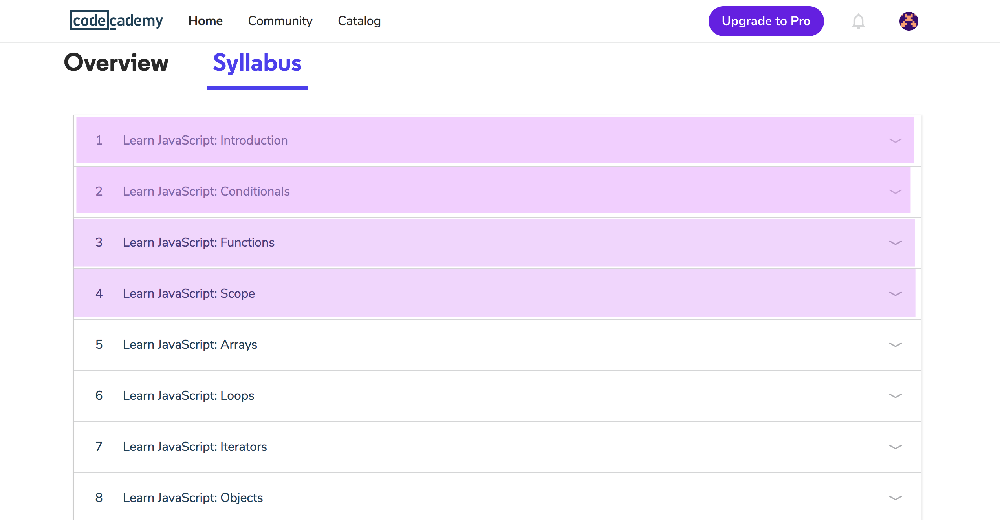

# CodeAcademy Part I - Intro, Conditionals, Functions and Scope

**Plan:** List steps/tasks in [Trello Boards](https://trello.com/cg_webdev_ss_2018)

**Do:** Download app to your phone and play (instructions below).

**Record:** [Lesson 8.1 - CodeAcademy Part I](https://learn.launchcode.org/courses/131/assignments/7224)

## Intro
CodeAcademy is the site you will be using to learn most of your Javascript skills. We will break up the CodeAcademy course into sections so you can learn some THEN apply it to a project... learn a little bit more... then apply it to a project etc.

So this assignment is to complete the first 4 sections of the CodeAcademy Introduction to Javascript Course. yay!

## Goals
1. Navigate to CodeAcademy & Create Account.
2. Take 4 sections of the Intro to Javascript Course.
3. Record canvas assignment.

## Step 1: Navigate to CodeAcademy & Create Account

Go to [CodeAcademy](https://www.codecademy.com/learn) to create an account. Note: We will NOT need the PRO plan. Just the free one.

## Step 2: Complete 4 sections of the Intro to Javascript Course

Complete just the first four sections of the Intro to Javascript course, Intro, Conditionals, Functions and Scope (see below picture). Then we will move you on to the next assignment... a project challenge.

## Step 3: Mark Complete in Canvas

Follow the Record link at the top of the page to mark this assignment complete!

On to the next assignment - first JS project challenge! whoo!
