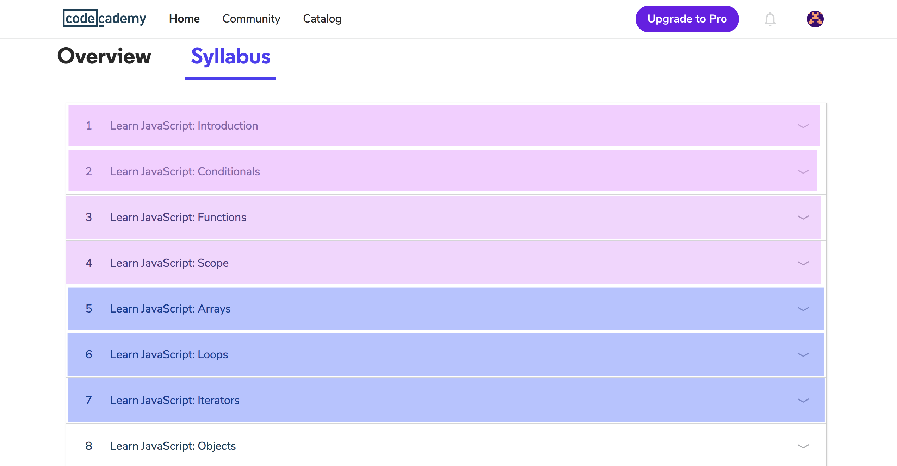

# CodeAcademy Part II - Array, Loops and Iterators

**Plan:** List steps/tasks in [Trello Boards](https://trello.com/cg_webdev_ss_2018)

**Do:** Download app to your phone and play (instructions below).

**Record:** [Lesson 9.1 - CodeAcademy Part II](https://learn.launchcode.org/courses/131/assignments/7224)

## Intro

Back to CodeAcademy to learn about javascript functions and scope of an application.

So this assignment is to complete the next 3 sections of the CodeAcademy Introduction to Javascript Course.

## Goals
1. Complete the next 3 sections of the Intro to Javascript Course.
2. Record canvas assignment.

## Step 1: Complete the next 3 sections

Complete just the next three sections (highlighted in BLUE below) of the Intro to Javascript course, Array, Loops, and Iterators (see below picture). Then we will move you on to more project challenges.

## Step 2: Mark Complete in Canvas

Follow the Record link at the top of the page to mark this assignment complete!

On to the next assignment - first JS project challenge! whoo!
